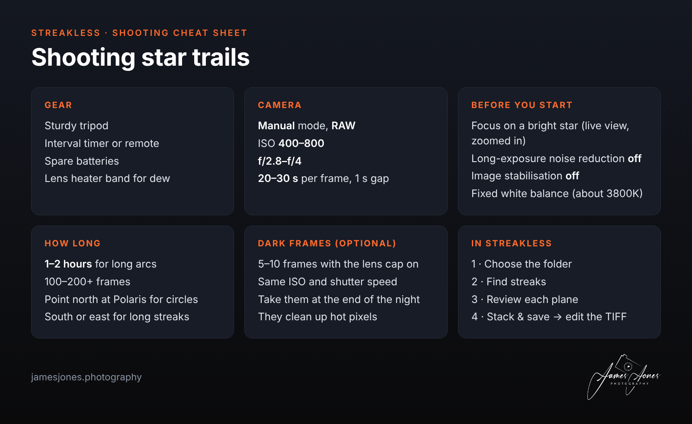
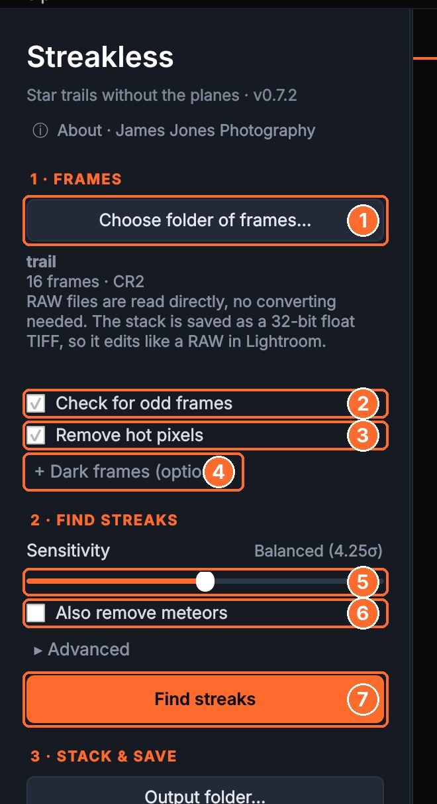
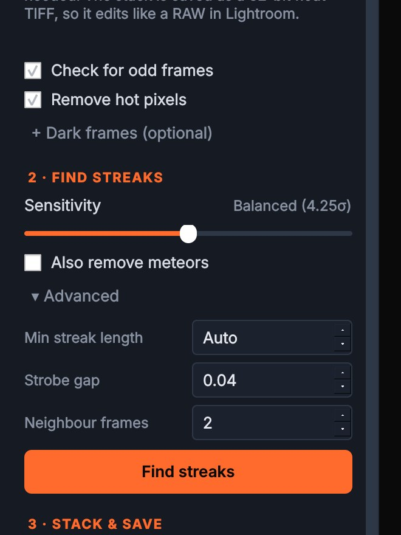
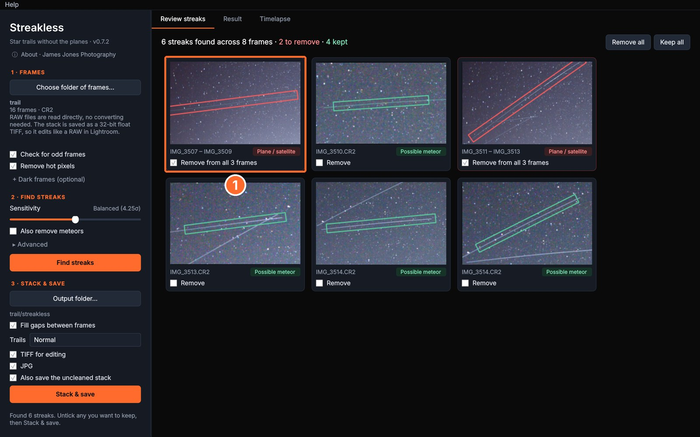
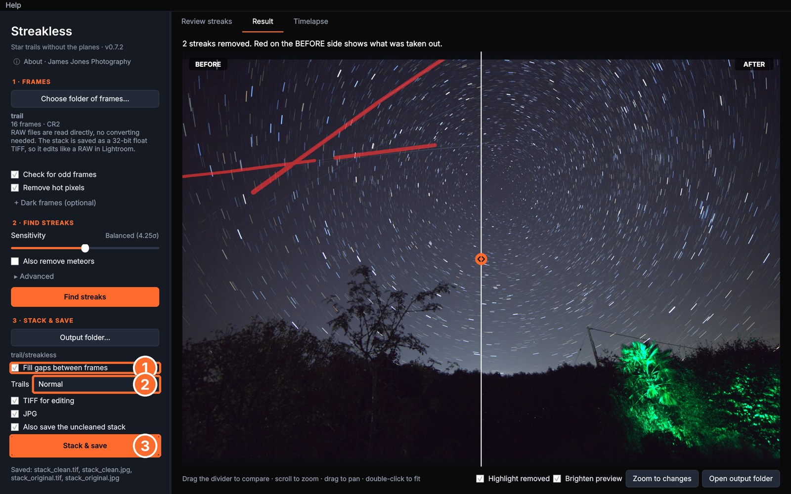
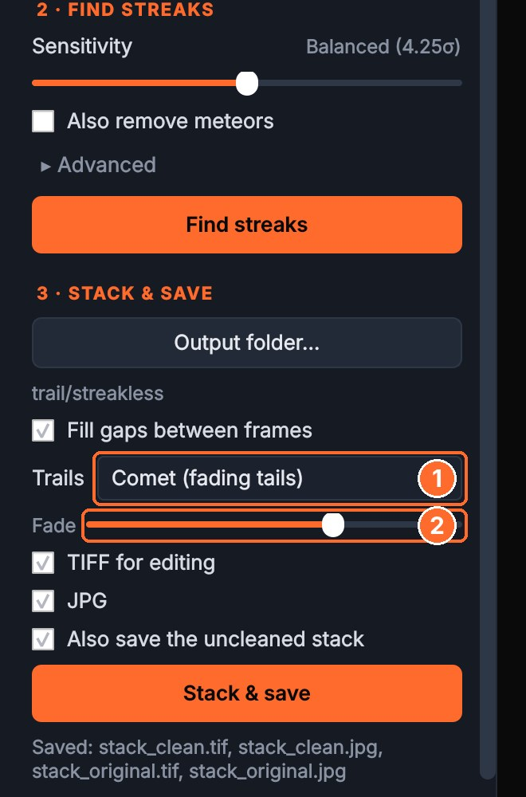
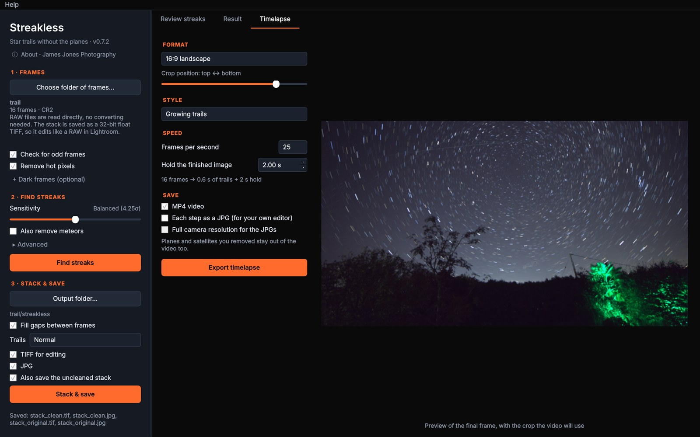

# How to use Streakless

Streakless turns a night of star-trail frames into one clean image. Aeroplanes and satellites are found and removed for you, meteors are kept, and you get a full-quality TIFF that edits like a RAW in Lightroom.

**On this page:** [Before you shoot](#before-you-shoot) · [Quick start](#quick-start) · [Step 1: Choose your frames](#step-1-choose-your-frames) · [Step 2: Find streaks](#step-2-find-streaks) · [Step 3: Review](#step-3-review-each-streak) · [Step 4: Stack & save](#step-4-stack--save) · [Timelapse](#make-a-timelapse) · [Editing in Lightroom](#editing-in-lightroom) · [Problems?](#problems-and-questions)

New to Streakless? Download it from [the latest release](../../releases/latest), and see the [download page](README.md#opening-it-the-first-time) for opening it the first time.

---

## Before you shoot

- **Shoot RAW.** Streakless reads Canon CR2/CR3, Nikon NEF, Sony ARW, Fuji RAF, DNG and more directly, so there's nothing to convert first. TIFF and JPG work too.
- **Keep the gaps short.** Use continuous shooting with a 1 s interval, and turn long-exposure noise reduction off in the camera, or every other frame is a black "dark frame" and the trails get gaps.
- **Don't move the camera.** Streakless stacks the frames exactly as shot.
- **Dark frames are optional.** Five to ten frames with the lens cap on, at the same ISO and shutter speed, clean up hot pixels. Streakless removes most hot pixels without them.

## Quick start

1. **Choose folder of frames…** and pick the folder with your night's frames.
2. Press **Find streaks**.
3. On **Review streaks**, check the cards: red ones will be removed, green ones kept.
4. Press **Stack & save**. Your TIFF and JPG are saved in a `streakless` folder next to your frames.

That's it. The rest of this guide explains each step and the options.

## Step 1: Choose your frames

**① Choose folder of frames…** opens a folder picker. You can also drag a folder onto the window. Streakless shows how many frames it found and what type they are.

**② Check for odd frames** (on by default) spots frames that don't belong:

- **too bright:** car headlights, a torch, flash or lightning;
- **too dark:** the lens cap left on or a misfire;
- **cloud or mist:** far fewer stars than the frames around it.

They're shown first on the review screen with the reason, and left out unless you put them back.

**③ Remove hot pixels** (on by default) removes the coloured specks that stay in the same place all night.

**④ + Dark frames (optional)** lets you pick a folder of lens-cap frames shot at the same ISO and shutter speed.

 

## Step 2: Find streaks

**⑤ Sensitivity** sets how hard Streakless looks. **Balanced** suits most nights. Slide right to catch fainter satellites; slide left if it's flagging things that aren't planes.

**⑥ Also remove meteors** is off by default, because most people want to keep them. Tick it to remove them too.

**⑦ Find streaks** compares every frame with its neighbours. Stars barely move from frame to frame, so they cancel out, and a plane or satellite stands out as a straight line. Wires, poles, roof edges and cloud are recognised and ignored.

**Advanced** (optional) has three settings:

- **Min streak length:** the shortest line treated as a plane or satellite. Auto suits most images.
- **Strobe gap:** the largest gap between a plane's flashing lights.
- **Neighbour frames:** how many frames either side are compared.

Changing these and pressing **Find streaks** again is quick, because the frames aren't read again.

 

## Step 3: Review each streak

Each plane, satellite or meteor gets **one card ①**, even when it crosses several frames (the card says which).

- **Red, "Plane / satellite":** ticked to be removed from all of its frames.
- **Green, "Possible meteor":** short, single-frame streaks, kept by default. Tick **Remove** if one is really a satellite.
- **Click a card** to see its whole path.
- **Remove all** and **Keep all** (top right) change every card at once.

The heading keeps count, for example "6 streaks found · 2 to remove · 4 kept".

## Step 4: Stack & save

In **3 · Stack & save**:

- **Output folder…** changes where files are saved. The default is a `streakless` folder next to your frames, so your originals are never touched.
- **① Fill gaps between frames** (on by default) joins the tiny breaks between frames along each trail, so trails look continuous.
- **② Trails: Normal or Comet.** Comet fades the start of each trail so the stars look like comets; the **Fade** slider sets how strongly.
- Choose the files you want: **TIFF for editing**, **JPG**, and optionally **Also save the uncleaned stack** for comparison.
- **③ Stack & save** builds the image.

The **Result** tab shows a before/after with a slider you can drag. **Highlight removed** marks what was taken out in red. **Zoom to changes** jumps to the removed streaks, and **Open output folder** takes you to your files. Scroll to zoom and drag to pan.

**Comet trails:** switch **Trails** to **Comet** and press **Stack & save** again. It's quick, because the frames aren't read again.

 

### What gets saved

| File | What it is |
|---|---|
| `stack_clean.tif` | The one to edit: 32-bit float from RAW, with a matching colour profile |
| `stack_clean.jpg` | Quick-look JPG |
| `stack_original.tif` / `.jpg` | The same stack without cleaning (if ticked) |
| `stack_report.json` | Every streak found and the settings used |

## Make a timelapse

The **Timelapse** tab turns the same frames into a video, with the planes still removed.

- **Format:** Original, 16:9 landscape, 9:16 vertical (Reels, TikTok, Stories), 1:1 square or 4:5 portrait (Instagram feed). The **crop position** slider picks which part of the frame to keep.
- **Style:** **Growing trails** build up over the video. **Comet trails** are fading tails that move across the sky.
- **Speed:** frames per second, and how long to hold the finished image at the end.
- **Save:** an **MP4 video**, and/or **each step as a JPG** for your own video editor (optionally at full camera resolution).

Press **Export timelapse**. Tip: a timelapse needs plenty of frames; 150 frames at 25 fps is a 6-second video.

## Editing in Lightroom

Import `stack_clean.tif` into Lightroom (or Photoshop / Camera Raw). It's a 32-bit linear file, so it opens a little flat and dark, just like a RAW. Edit it as you would a RAW: exposure, white balance, contrast, clarity, noise reduction and lens corrections. All the detail is there.

## Problems and questions

**It found a streak that isn't a plane.** Untick it on its card, or lower **Sensitivity** and press **Find streaks** again.

**It missed a faint satellite.** Raise **Sensitivity** a little and press **Find streaks** again.

**A frame was left out that I want.** On the review screen, untick **Leave out of the stack** on that frame's card.

**There are gaps in my trails.** Check that **Fill gaps between frames** is on. Next time, set a 1 s interval and turn off long-exposure noise reduction in the camera.

**The TIFF looks dark.** That's normal for a linear 32-bit file. Raise exposure in Lightroom, or use the JPG for a quick look.

**macOS or Windows won't open it.** See [opening it the first time](README.md#opening-it-the-first-time).

**Still stuck?** [Open an issue](../../issues), and say what you were doing, which camera and which computer.

---

Streakless is free from [James Jones Photography](https://jamesjones.photography). Your original photos are never changed.
